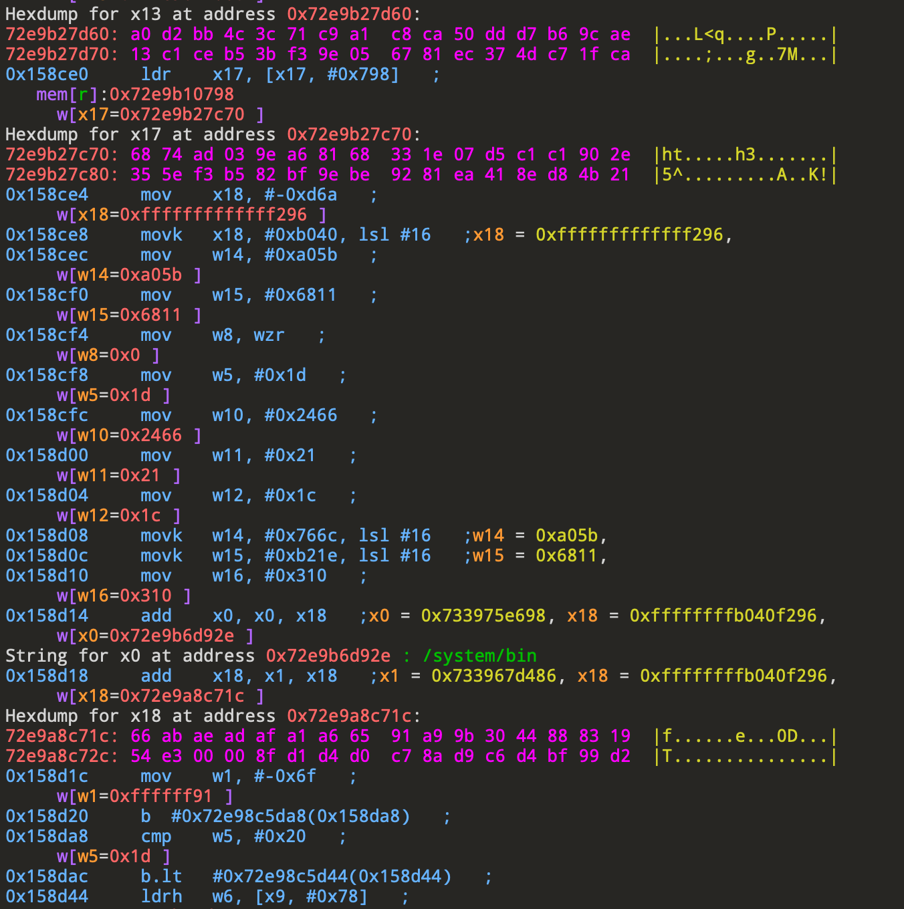
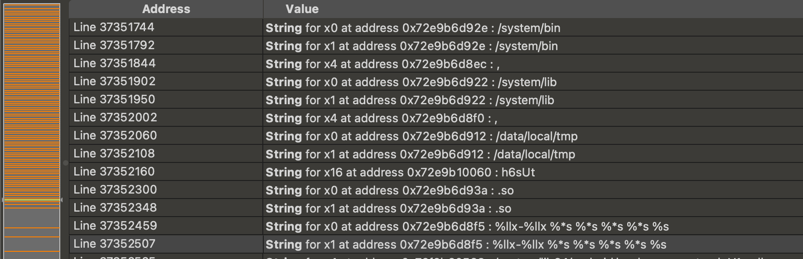
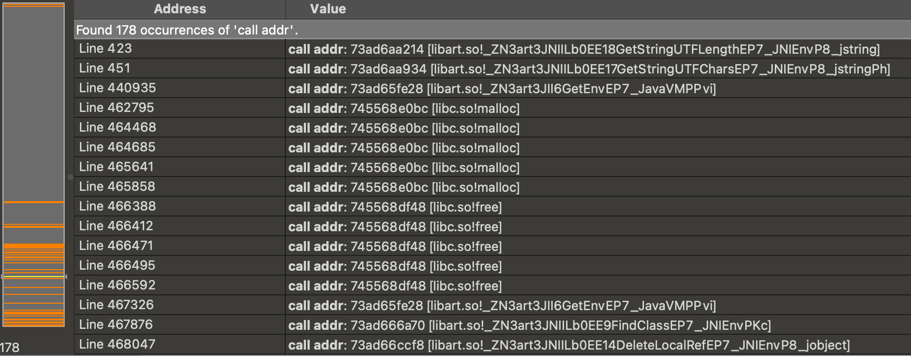

# gumTVM
Use frida-gum's stalker for tracing
## How to use
You need to modify some fields in the gumTrace.js script
```
// target so
var Module_name = "libmyapplication.so"  
// target func offset
var target_offset = 0x2EBD4               
// app package name
var package_name = "com.example.myapplication"
// trace file
var trace_file_name = "trace.txt"
```
gumTrace.js is the frida script used to inject libgumTVM.so into the target app (and call the initialization function). You can also use other injection methods.


It can trace the executed instructions, register changes and hexdump corresponding to the address


A possible string for the address


Information about external functions called


## solve Stalker bug
Refer to this issue to solve the stalker bug of Unable to allocate code slab near frequently appearing
[https://github.com/frida/frida-gum/issues/793]()